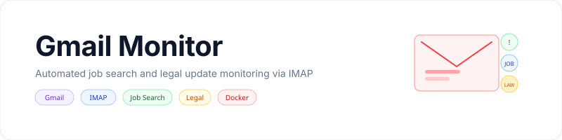

<p align="center">
    <picture>
        <source media="(prefers-color-scheme: dark)" srcset="art/banner-dark.svg">
        <source media="(prefers-color-scheme: light)" srcset="art/banner-light.svg">
        
    </picture>
</p>

<p align="center">
Automated job search and legal update monitoring via Gmail IMAP
</p>

<p align="center">
<a href="https://github.com/jeremykenedy/gmail-monitor/actions/workflows/tests.yml"></a>
<a href="LICENSE"></a>
</p>

## Table of Contents

- [About](#about)
- [Features](#features)
- [Requirements](#requirements)
- [Installation](#installation)
- [Quick Start](#quick-start)
- [What It Monitors](#what-it-monitors)
- [Configuration](#configuration)
- [Docker Deployment](#docker-deployment)
- [Output](#output)
- [License](#license)

## About

A Python-based Gmail monitor that connects via IMAP every 15 minutes and filters emails for job search and legal updates. Runs as a Docker container and writes results to a shared summary file for Claude AI to consume via MCP.

## Features

- Checks Gmail every 15 minutes via IMAP
- Categorizes emails as job-search or legal
- Flags urgent items (interviews, court dates, deadlines)
- Excludes noise from shopping/delivery senders
- Writes JSON results and human-readable markdown summary
- Runs as a lightweight Docker container (Python Alpine)
- Integrates with Claude AI via shared summary file

## Requirements

- Python 3.12+
- Docker (for container deployment)
- Gmail App Password (not your account password)

## Installation

```bash
git clone https://github.com/jeremykenedy/gmail-monitor.git
cd gmail-monitor
python setup.py
```

## Quick Start

Run the interactive setup wizard:

```bash
python setup.py
```

The wizard walks through Gmail credentials, output paths, and timezone. It creates a `.env` file with your configuration.

Get a Gmail App Password at https://myaccount.google.com/apppasswords

## What It Monitors

### Job Search

Senders: LinkedIn, Indeed, Dice, LaraJobs, Glassdoor, ZipRecruiter, Lever, Greenhouse, Workday, SmartRecruiters, Jobvite

Keywords: interview, offer, application, position, hiring, candidate, role, opportunity, recruiter, salary, compensation

### Legal

Senders: attorneys, law firms, courts, paralegals

Keywords: case, hearing, filing, settlement, court, motion, order, petition, custody, decree, mediation, deposition

### Excluded (false positive prevention)

Amazon, eBay, UPS, FedEx, USPS, DHL, Target, Walmart, BestBuy, ParentSquare

Legal categorization requires 2+ keyword matches to reduce noise.

## Configuration

| Variable | Description |
|----------|-------------|
| `GMAIL_USER` | Gmail address |
| `GMAIL_APP_PASSWORD` | Gmail App Password (not account password) |
| `OUTPUT_DIR` | Where to write JSON results |
| `SUMMARY_FILE` | Path to shared monitor-summary.md |
| `TZ` | Timezone (default: America/Los_Angeles) |

## Docker Deployment

```bash
docker build -t gmail-monitor:latest .

docker run -d \
  --name gmail-monitor \
  --restart unless-stopped \
  --env-file .env \
  -v /path/to/gmail-monitor:/data/gmail-monitor:rw \
  -v /path/to/.claude:/data/.claude:rw \
  gmail-monitor:latest
```

## Output

### latest.json

```json
{
  "checked_at": "2026-04-02T23:57:18",
  "new_relevant_count": 17,
  "job_search": [{"subject": "...", "from": "...", "category": "job-search"}],
  "legal": [{"subject": "...", "from": "...", "category": "legal"}],
  "urgent": [{"subject": "...", "urgent": true}]
}
```

### monitor-summary.md

Human-readable markdown summary consumed by Claude AI via the `read_monitor_summary` MCP tool.

## License

This package is open-sourced software licensed under the [MIT license](LICENSE).
